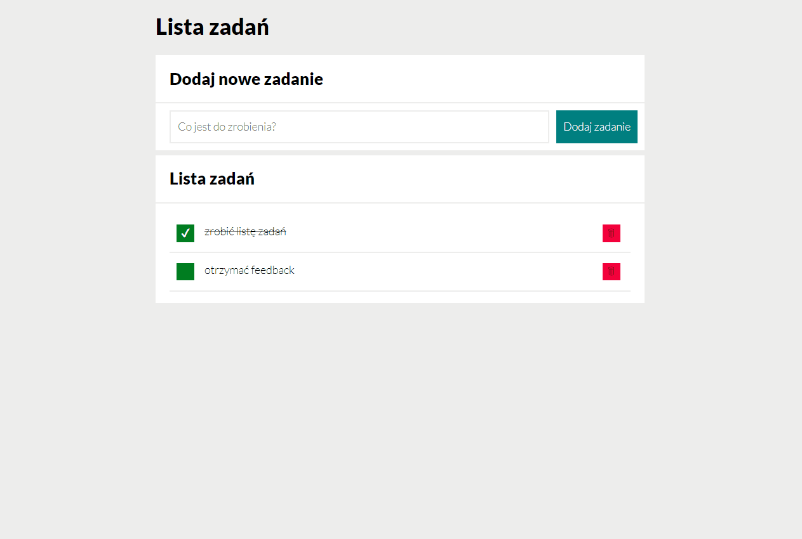

# Hello everyone ! 😉

Here's my yet another scope of work [**A simple task list** - feel free to check it out :)](https://woytekmig.github.io/taskList/)

This time, I was incresing skills mostly in:  
- [x] **JS** (ES6)
And also using BEM convention in :
- [x] **HTML** 
- [x] **CSS**  

It is another exercise task during YouCode programmig course  :) Here's a little demo : 

The task was to make... task list :) Major events are taking place in script.js. I've learned many new useful elements, such as creating tables or adding (and removing) elements to the html code through the input. Fell free to check me ;) 

### _The journey begins to be attractive... ;)_